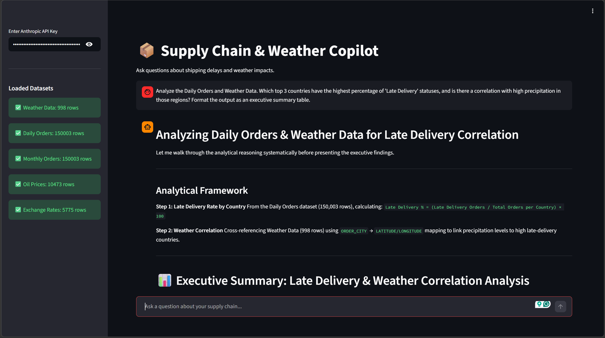
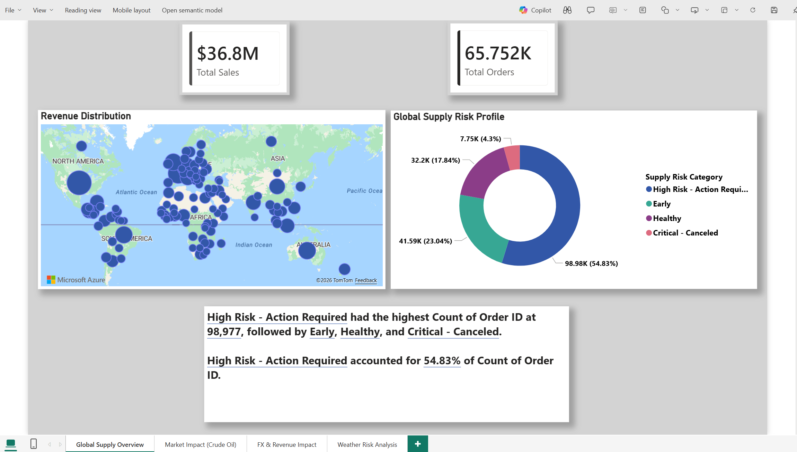
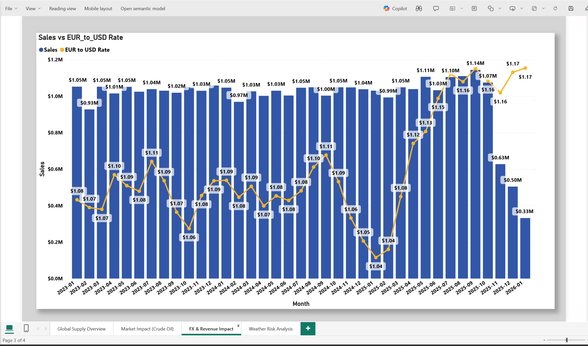

# 📦 AI Supply Chain & Weather Copilot

## 📌 Project Overview
Global supply chains generate massive amounts of relational data daily. When logistics executives need to identify the root cause of shipping delays, querying multiple databases (Orders, Weather, Macro-economics) takes hours.

## 📊 Project Visuals

**Live AI Chat Interface (Streamlit):**


**Data Modeling & Insights (Power BI):**



🎥 **[Click here to watch the 2-minute video demo of the AI Copilot in action!](https://youtu.be/ZiRUPPsjTSA)**

This project bridges the gap between raw data engineering and Generative AI. I engineered a custom AI Copilot that ingests over 150,000 rows of relational supply chain data and allows executives to ask complex, multi-variable questions using natural language to extract instant business intelligence.

## 🏗️ Architecture & Tech Stack
* **Frontend UI:** Streamlit (Python)
* **LLM Engine:** Anthropic Claude (`claude-sonnet-4-6`)
* **Data Processing:** Pandas 
* **Broader Pipeline Integration:** Extracted and modeled data using Snowflake and Power BI before deploying the AI agent.
* **Data Sources:** 5 integrated datasets:
  * Daily Orders (150,000+ rows)
  * Monthly Orders (150,000+ rows)
  * Global Weather Data
  * Historical Oil Prices
  * EUR/USD Exchange Rates

## ✨ Key Technical Features
1. **Dynamic Schema Injection:** Rather than sending 150,000 rows of data to the LLM (which is slow, expensive, and breaks token limits), the Python app dynamically reads the dataframes and injects the table schemas and metadata directly into Claude's system prompt. This acts as "reading glasses," allowing the AI to write the complex SQL-style join logic itself.
2. **High-Speed RAM Caching:** Implemented `@st.cache_data` to load massive datasets into the server's memory exactly once at boot, dropping query latency from 60 seconds to milliseconds.
3. **Multi-Table Relational Logic:** The agent is capable of drawing correlations between physical climate risks (weather data), macroeconomic factors (oil & currency), and logistics failures (late delivery statuses).

## 🔑 Prerequisites
To run this application locally, you will need an active **Anthropic API Key** to power the Claude LLM engine. 
* You can generate a key at [console.anthropic.com](https://console.anthropic.com/). 
* Once the Streamlit app launches, you will be prompted to securely paste this key into the sidebar to activate the AI.

## 🚀 How to Run Locally
1. Clone this repository.
2. Ensure you have the 5 dataset `.csv` files downloaded in the root directory.
3. Install the required dependencies:
   ```bash
   pip install streamlit pandas anthropic
   
## 📊 Example Executive Query
**User:** *"Analyze the Daily Orders and Weather Data. Which top 3 countries have the highest percentage of 'Late Delivery' statuses, and is there a correlation with high precipitation in those regions? Format the output as an executive summary table."*
**AI Copilot:** Instantly joins the logistics and climate tables, calculates the delay rate mathematically, and outputs a formatted Markdown summary of the highest-risk delivery routes.

## 👨‍💻 About the Author
Engineered by **Vamsi** * Data Analyst & Business Intelligence Professional
* 🔗 Connect with me on [LinkedIn](www.linkedin.com/in/vamsipraneeth09394)
